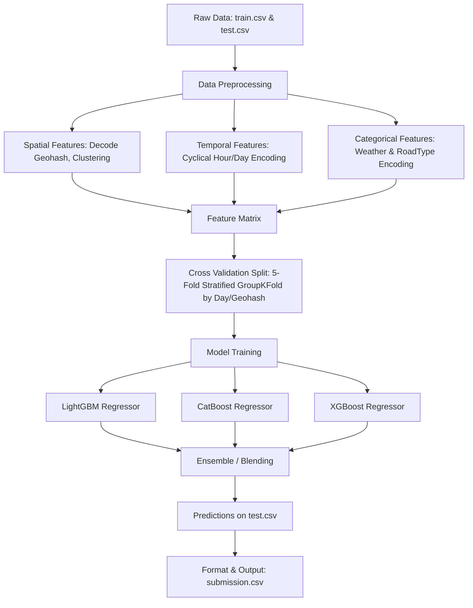

# 🚦 Flipkart Gridlock Hackathon 2.0: Traffic Demand Prediction

[](https://www.python.org/)
[](https://opensource.org/licenses/MIT)
[](https://www.hackerrank.com/)

Cities worldwide are increasingly turning to AI-powered solutions to tackle traffic congestion. This project aims to design a system that provides valuable insights into passenger travel patterns, booking behavior, and trip cancellations to predict travel demand within urban areas. By forecasting demand accurately, city planning agencies and transportation providers can implement data-driven strategies to alleviate congestion and promote efficient mobility.

---

## 📋 Table of Contents
- [Project Overview](#-project-overview)
- [Dataset Description](#-dataset-description)
- [Feature Engineering & Methodology](#-feature-engineering--methodology)
- [Proposed Architecture](#-proposed-architecture)
- [Project Structure](#-project-structure)
- [Getting Started](#-getting-started)
- [Model Training & Evaluation](#-model-training--evaluation)
- [Submission Guidelines](#-submission-guidelines)
- [License](#-license)

---

## 🔍 Project Overview

The goal of this project is to analyze and build predictive models for **Traffic Demand Prediction** based on spatio-temporal, road infrastructure, and environmental factors. 

### Key Objectives:
1. **Spatio-Temporal Analysis**: Understand travel demand across different areas using geohash representations and timestamps.
2. **Infrastructure Correlation**: Relate road attributes (number of lanes, large vehicle permissions, landmarks) with demand peaks.
3. **Environmental Adaptation**: Quantify the impact of weather and temperature variations on travel patterns.
4. **Demand Forecasting**: Predict the numerical `demand` for traffic at specific locations and times.

---

## 📊 Dataset Description

The dataset folder is expected to contain the following files:
*   `train.csv`: Training dataset containing **77,299** rows and **11** columns (features + target).
*   `test.csv`: Testing dataset containing **41,778** rows and **10** columns (features only).
*   `sample_submission.csv`: Template for submissions containing **5** sample rows and **2** columns (`Index`, `demand`).

### Variable Descriptions

| Column Name | Description | Data Type / Format |
| :--- | :--- | :--- |
| **Index** | Unique identifier for each data point | Integer / Key |
| **geohash** | Geohash string representing location coordinates | String (categorical/spatial) |
| **day** | The day index when the information is recorded | Integer (sequential day) |
| **timestamp** | Time of the record insertion in the system | Time (HH:MM or HH:MM:SS) |
| **RoadType** | Classification of the road in the nearby location | Categorical |
| **NumberofLanes** | Number of lanes/roads present at the location | Integer |
| **LargeVehicles** | Indicates whether large vehicles are permitted | Boolean/Binary |
| **Landmarks** | Indicates proximity to landmarks near the location | Boolean/Binary |
| **Temperature** | Temperature of the place at the given timestamp | Float/Numeric |
| **Weather** | Weather condition of the place | Categorical |
| **demand** *(Target)* | Traffic demand at the specific location & timestamp | Float/Numeric [0.0 - 1.0] |

---

## 🛠️ Feature Engineering & Methodology

To achieve high accuracy (maximize $R^2$), a robust preprocessing and feature engineering pipeline is critical:

### 1. Spatial Features (Geohash Decoding)
Geohash is a hierarchical spatial data structure. We can decode geohashes into latitude and longitude coordinates to capture absolute distances:
```python
import geohash

def decode_geohash(df):
    df['latitude'] = df['geohash'].apply(lambda x: geohash.decode(x)[0])
    df['longitude'] = df['geohash'].apply(lambda x: geohash.decode(x)[1])
    return df
```
*   **Spatial Clustering**: Run K-Means on coordinates to group neighboring zones.
*   **Geohash Target Encoding**: Compute mean historical demand per geohash zone (using out-of-fold validation to prevent leakage).

### 2. Temporal Features (Timestamp Extraction)
*   **Time of Day**: Extract hour, minute, and second from `timestamp`.
*   **Cyclical Encoding**: Encode hour and day-of-week using sine and cosine transformations to preserve cyclical proximity (e.g., 23:59 is close to 00:01):
    $$\text{Hour\_sin} = \sin\left(\frac{2\pi \times \text{Hour}}{24}\right), \quad \text{Hour\_cos} = \cos\left(\frac{2\pi \times \text{Hour}}{24}\right)$$
*   **Lag Features**: Create rolling averages of demand for the same geohash location in previous days/hours.

### 3. Categorical Encoding
*   Encode `Weather` and `RoadType` using **One-Hot Encoding** or **Target/Frequency Encoding**.
*   Map binary variables (`LargeVehicles`, `Landmarks`) to binary integers (`0` or `1`).

---

## 🧠 Proposed Architecture

A combination of gradient boosting frameworks and neural networks yields the best results for tabular spatial-temporal data:



---

## 📂 Project Structure

```directory
traffic-demand-prediction/
│
├── data/
│   ├── train.csv                # Training dataset (77299 x 11)
│   ├── test.csv                 # Test dataset (41778 x 10)
│   └── sample_submission.csv    # Submission template (5 x 2)
│
├── notebooks/
│   ├── 01_eda_and_geohash.ipynb # Exploratory Data Analysis & spatial visualization
│   └── 02_model_training.ipynb  # Model training, validation, and ensembling
│
├── src/
│   ├── __init__.py
│   ├── preprocessing.py         # Data cleaning, geohash decoding & cyclical encoding
│   ├── features.py              # Feature engineering & target encoding scripts
│   └── models.py                # Model training, cross-validation, and inference
│
├── submissions/
│   └── final_submission.csv     # Final predictions output (41778 x 2)
│
├── requirements.txt             # Python dependencies
└── README.md                    # Project documentation (this file)
```

---

## 🚀 Getting Started

### Prerequisites
Make sure you have **Python 3.8+** installed.

### Installation
1. Clone the repository to your local workspace:
   ```bash
   git clone https://github.com/your-username/traffic-demand-prediction.git
   cd traffic-demand-prediction
   ```

2. Install the required packages:
   ```bash
   pip install -r requirements.txt
   ```

3. Download the dataset and place it inside the `data/` folder.

---

## 📈 Model Training & Evaluation

### Evaluation Metric
The submission is evaluated based on the **R-squared ($R^2$) Score** scaled to a max score of 100:
$$\text{Score} = \max\left(0, 100 \times R^2(\text{actual}, \text{predicted})\right)$$

### Training Script Example
To train the default ensemble model (LightGBM + CatBoost) and output the submission file, run:
```bash
python src/models.py --train --predict
```

Or step through the Jupyter notebooks in the `notebooks/` directory.

---

## 📝 Submission Guidelines

Ensure your submission conforms to the following rules to prevent evaluation failure:
*   **Format**: A single CSV file with exactly **41,778 rows** and **2 columns**.
*   **Columns**: Must contain exactly `Index` and `demand`.
*   **Index**: Must match the `Index` values present in `test.csv` sequentially.

Example of submission format:
```csv
Index,demand
0,0.4859
1,0.1294
2,0.8931
3,0.3456
4,0.7812
...
```

---

## 📄 License
This project is licensed under the MIT License - see the [LICENSE](LICENSE) file for details.
