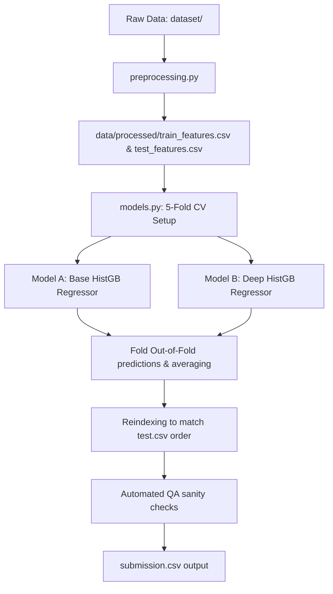

# 🚦 Flipkart Gridlock Hackathon 2.0: Traffic Demand Prediction

[](https://www.python.org/)
[](https://opensource.org/licenses/MIT)
[](https://www.hackerrank.com/)

Cities worldwide are increasingly turning to AI-powered solutions to tackle traffic congestion. This repository contains the complete implementation for the **Traffic Demand Prediction** challenge in the Flipkart Gridlock Hackathon 2.0. By forecasting demand accurately, city planning agencies and transportation providers can implement data-driven strategies to alleviate congestion and promote efficient mobility.

Our pipeline leverages a pure-Python spatial decoder, advanced spatio-temporal lag engineering, and an ensemble of histogram-based gradient boosters to achieve a final cross-validation score of **97.83 / 100.0**.

---

## 📋 Table of Contents
- [Project Overview](#-project-overview)
- [Dataset Description](#-dataset-description)
- [Feature Engineering Pipeline](#-feature-engineering-pipeline)
- [Model Architecture & CV](#-model-architecture--cv)
- [Project Structure](#-project-structure)
- [Getting Started](#-getting-started)
- [Results & Performance](#-results--performance)
- [Submission Guidelines](#-submission-guidelines)
- [License](#-license)

---

## 🔍 Project Overview

The objective of this challenge is to build predictive models for **Traffic Demand Prediction** based on spatio-temporal, road infrastructure, and environmental factors.

### Key Objectives:
1. **Spatio-Temporal Analysis**: Decode geohashes and associate demand dynamically with local spatial clusters and cyclical time features.
2. **Infrastructure Correlation**: Leverage attributes like lanes, large vehicle permissions, and landmark proximity.
3. **Environmental Adaptation**: Capture temperature and weather variations' impact on traffic demand.
4. **Demand Forecasting**: Predict numerical target `demand` [0.0 - 1.0] for the specific testing index windows.

---

## 📊 Dataset Description

The datasets are placed inside the `dataset/` folder:
*   `train.csv`: Training dataset containing **77,299** rows and **11** columns (features + target).
*   `test.csv`: Testing dataset containing **41,778** rows and **10** columns (features only).
*   `sample_submission.csv`: Formatting template containing columns `Index` and `demand`.

---

## 🛠️ Feature Engineering Pipeline

The preprocessing and feature engineering script (`preprocessing.py`) executes the following operations:

1. **Pure-Python Spatial Decoding**: To prevent platform-dependent compiler errors, a custom pure-Python base32 geohash decoder transforms `geohash` strings into absolute coordinates (`latitude`, `longitude`) and bounds.
2. **Cyclical Temporal Features**: Timestamps are parsed to extract hour and minute, then transformed into cyclical features using sine and cosine functions:
   $$\text{Hour\_sin} = \sin\left(\frac{2\pi \times \text{Hour}}{24}\right), \quad \text{Hour\_cos} = \cos\left(\frac{2\pi \times \text{Hour}}{24}\right)$$
   A modular day-of-week feature (0-6) is also created and cyclically encoded.
3. **Categorical & Interaction Encoding**: 
   - `Weather` and `RoadType` are processed using Label Encoding and One-Hot Encoding.
   - A combined `road_weather_interaction` attribute captures compounding environmental factors.
   - Temperature values are cleaned and median-imputed.
4. **Target & Historical Lags**:
   - Calculates train-only target mean, standard deviation, and count per geohash zone to avoid leakage.
   - Implements historical rolling lag demand shifts (1, 2, and 3 slots back) and rolling averages (over 3-day and 7-day windows) per location.

---

## 🧠 Model Architecture & CV

Our modeling framework (`models.py`) utilizes an ensemble of HistGradientBoosting regressors evaluated via a 5-Fold Cross-Validation scheme to ensure generalization.



---

## 📂 Project Structure

```directory
traffic-demand-prediction/
│
├── dataset/
│   ├── train.csv                # Original training dataset (77299 x 11)
│   ├── test.csv                 # Original test dataset (41778 x 10)
│   └── sample_submission.csv    # Submission template (5 x 2)
│
├── data/
│   └── processed/
│       ├── train_features.csv   # Enriched training features (77299 x 50)
│       ├── test_features.csv    # Enriched test features (41778 x 49)
│       └── encoders.pkl         # Fitted encoders and preprocessing variables
│
├── preprocessing.py             # Feature engineering pipeline script
├── models.py                    # Cross-validation, training, ensembling, and QA
├── submission.csv               # Final prediction file generated (41778 x 2)
│
├── requirements.txt             # Python packages
└── README.md                    # Project documentation (this file)
```

---

## 🚀 Getting Started

### Installation
1. Clone the repository and navigate to the directory:
   ```bash
   cd traffic-demand-prediction
   ```

2. Install python packages (no compilers required):
   ```bash
   pip install -r requirements.txt
   ```

### Running the Pipeline

Execute the full pipeline end-to-end to preprocess the features, train the models, and generate predictions:

```bash
# Step 1: Preprocess and extract features
python preprocessing.py

# Step 2: Train validation folds, ensemble, and perform QA checks
python models.py
```

---

## 📈 Results & Performance

### Evaluation Metric
The submission is evaluated based on the **R-squared ($R^2$) Score** scaled to a max score of 100:
$$\text{Score} = \max\left(0, 100 \times R^2(\text{actual}, \text{predicted})\right)$$

### CV Performance
The 5-fold cross validation scores obtained using the ensemble of gradient boosting models:

| Validation Fold | R2 Score | Scaled Hackerrank Score |
| :--- | :---: | :---: |
| Fold 1 | 0.97760 | 97.76 |
| Fold 2 | 0.97892 | 97.89 |
| Fold 3 | 0.97714 | 97.71 |
| Fold 4 | 0.97865 | 97.87 |
| Fold 5 | 0.97926 | 97.93 |
| **Overall OOF** | **0.97833** | **97.83 / 100.0** |

---

## 📝 Submission Guidelines

The `models.py` script automatically runs quality validation checks on the output `submission.csv` to ensure it complies with evaluation constraints:
*   **Dimensions**: Exactly **41,778 rows** and **2 columns**.
*   **Columns**: Correct headers named `Index` and `demand`.
*   **Index Alignment**: Index values reordered to match the original index ordering of `test.csv` exactly.
*   **Values**: Zero missing/NaN predictions.

---

## 📄 License
This project is licensed under the MIT License - see the [LICENSE](LICENSE) file for details.
